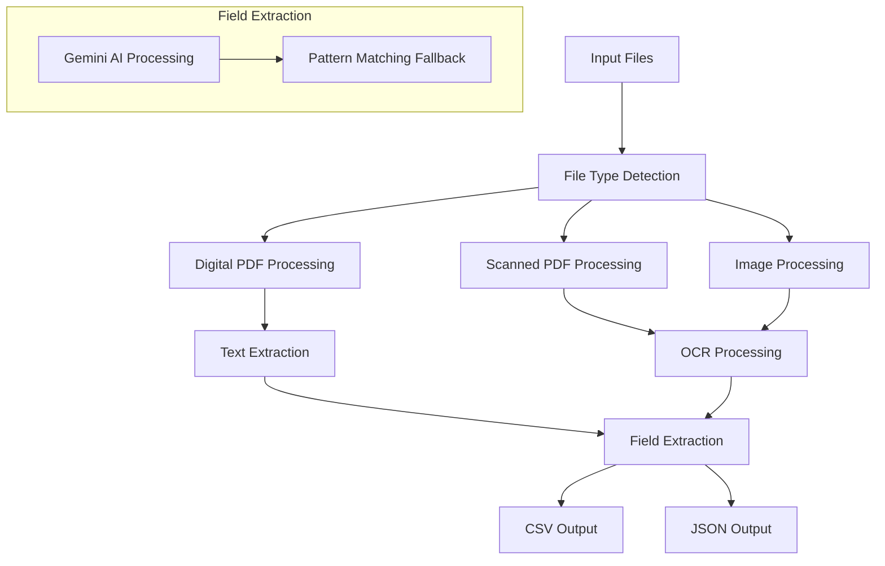

# PDF Field Extraction Pipeline

## Overview
This project implements an automated pipeline for extracting specific fields from PDF documents and images using OCR, Google's Gemini AI, and advanced text processing techniques. The solution provides both a command-line interface and a web interface using Streamlit.

## Pipeline Diagram


## Implementation Details

### Tools and Libraries Used

1. **PDF Processing**
   - pdfplumber: For digital PDF text extraction
   - pdf2image: For converting PDFs to images
   - PyPDF2: For PDF manipulation

2. **OCR Processing**
   - Tesseract OCR (pytesseract): For optical character recognition
   - OpenCV: For image preprocessing
   - Pillow: For image handling

3. **AI and Text Processing**
   - Google Gemini AI: For intelligent field extraction
   - spaCy: For natural language processing
   - scikit-learn: For text classification

4. **Web Interface**
   - Streamlit: For the web application interface
   - pandas: For data manipulation and CSV handling

5. **Development Tools**
   - pytest: For unit testing
   - black: For code formatting
   - flake8: For code linting

## Setup and Installation

1. **Prerequisites**
   - Python 3.8 or higher
   - Tesseract OCR installed on your system
   - Google API key for Gemini AI
   - Virtual environment (recommended)

2. **Installation Steps**
   ```bash
   # Clone the repository
   git clone [repository-url]
   cd [repository-name]

   # Create and activate virtual environment
   python -m venv venv
   source venv/bin/activate  # On Windows: venv\Scripts\activate

   # Install dependencies
   pip install -r requirements.txt

   # Set up environment variables
   cp .env.example .env
   # Add your GOOGLE_API_KEY to .env
   ```

3. **Running the Application**

   Web Interface:
   ```bash
   streamlit run app.py
   ```

   Command Line:
   ```bash
   python extract_invoices.py
   ```

## Features

1. **Multi-format Support**
   - Digital PDFs
   - Scanned PDFs
   - Images (JPG, PNG)

2. **Field Extraction**
   - Invoice number
   - Dates (invoice and due dates)
   - Vendor information
   - Customer details
   - Line items
   - Financial information
   - Payment details

3. **Output Formats**
   - CSV export
   - JSON export
   - Raw text extraction

4. **Processing Methods**
   - Primary: Google Gemini AI for intelligent extraction
   - Fallback: Pattern matching for reliability
   - OCR for scanned documents

## Security

- API keys stored in environment variables
- No sensitive information in codebase
- Secure file handling
- Input validation

## License

This project is licensed under the Apache 2.0 License - see the [LICENSE](LICENSE) file for details.

## Contributing

1. Fork the repository
2. Create your feature branch
3. Commit your changes
4. Push to the branch
5. Create a Pull Request

## Contact

For questions and support, please open an issue in the repository. 
